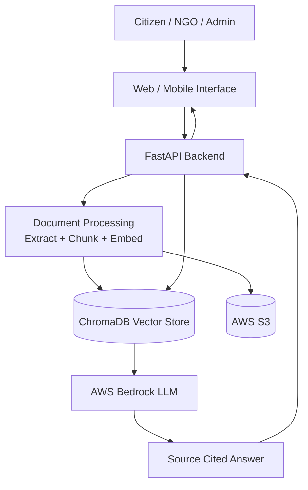
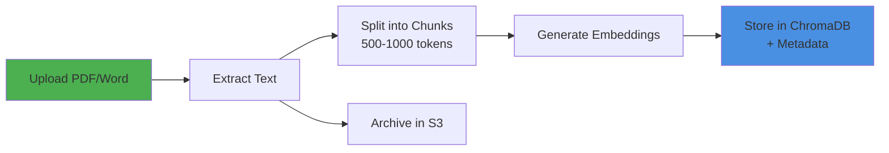
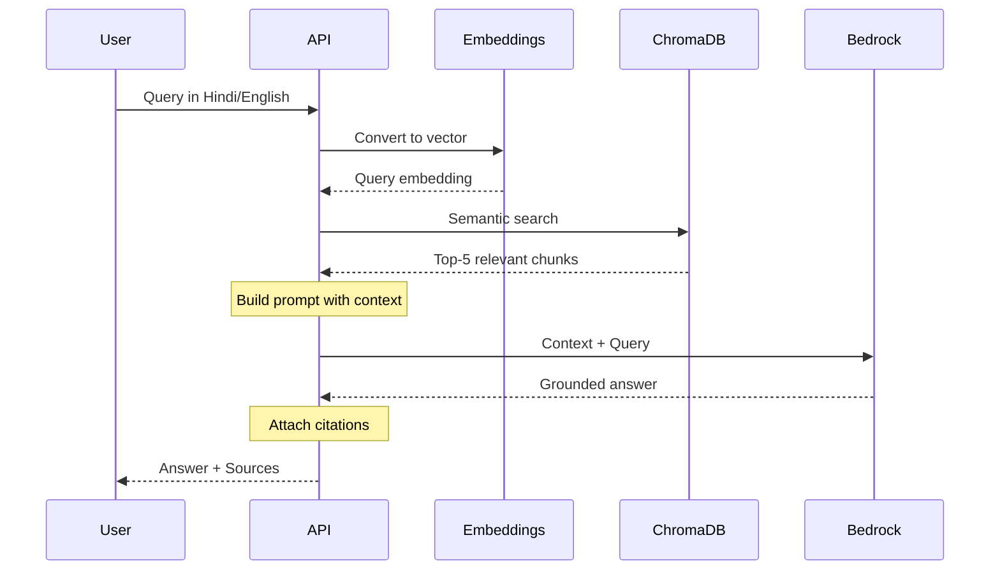

# PubliQ - System Design Document

**AI-Powered Civic Assistant for Government Scheme Discovery**

**AWS AI for Bharat Hackathon | February 2026**

---

## 1. Executive Summary

PubliQ bridges the information gap between citizens and government welfare schemes using conversational AI. Citizens, NGOs, and administrators can discover schemes through natural language queries in Hindi and English.

**Core Innovation**: RAG (Retrieval-Augmented Generation) architecture ensures every answer is grounded in official documents, preventing AI hallucination and providing verifiable source citations.

**Key Features**:
- Multilingual support (Hindi/English) with cross-lingual retrieval
- Source-cited answers with document references
- Optimized for rural/low-bandwidth environments
- Scalable, cost-efficient AWS infrastructure

---

## 2. System Architecture

### Technology Stack

| Component | Technology | Purpose |
|-----------|-----------|---------|
| Backend | FastAPI (Python) | API orchestration & RAG pipeline |
| Vector DB | ChromaDB | Semantic search & embeddings storage |
| Embeddings | Sentence Transformers | Multilingual text vectorization |
| LLM | AWS Bedrock (Claude/Titan) | Grounded answer generation |
| Storage | AWS S3 | Document repository |
| Security | AWS IAM | Least-privilege access control |

### Architecture Diagram



---

## 3. RAG Pipeline Workflow

### 3.1 Document Ingestion



**Process**:
1. Admin uploads government scheme documents
2. Text extracted and split into semantic chunks with overlap
3. Each chunk converted to 384-dim vector (multilingual model)
4. Vectors stored with metadata: `scheme_name`, `source_url`, `language`

### 3.2 Query Processing



**Process**:
1. User query converted to vector using same embedding model
2. ChromaDB performs cosine similarity search
3. Top-K relevant chunks retrieved with metadata
4. LLM generates answer using ONLY retrieved context
5. Response includes citations linking to source documents

**Example Prompt**:
```
System: Answer based ONLY on provided context. Include citations.

Context:
[Chunk 1: PM-KISAN eligibility criteria...]
[Chunk 2: Application process...]

Query: मुझे PM-KISAN के बारे में बताएं

Respond in Hindi with source references.
```

---

## 4. Security & Privacy

### AWS IAM Roles (Least Privilege)

**Query Service Role**:
- `bedrock:InvokeModel` (specific models only)
- `s3:GetObject` (read-only)
- No write/delete permissions

**Ingestion Role**:
- `s3:PutObject` (document bucket only)
- Time-limited credentials
- Separate from query role

**Benefits**:
- Compromised API cannot delete documents
- Audit trail for all operations
- Automatic credential rotation

### Data Privacy

**Why Only Retrieved Chunks Go to LLM**:
- Cost control (pay per token)
- Context window limits
- Privacy (no exposure of unrelated docs)
- Performance (faster responses)

**Security Measures**:
- TLS encryption for all data in transit
- Query anonymization
- No PII in vector database
- CloudWatch audit logging

---

## 5. Design Principles

### 5.1 Grounded AI
- RAG ensures answers are traceable to source documents
- System prompt forbids hallucination
- "I don't know" responses when no relevant docs found

### 5.2 Source Transparency
- Every response includes clickable citations
- Links to original government documents
- Relevance scores displayed

### 5.3 Multilingual Support
- Shared vector space for Hindi/English
- Cross-lingual retrieval (query in Hindi, retrieve English docs)
- LLM responds in user's language

### 5.4 Scalability
- Stateless FastAPI (horizontal scaling)
- ChromaDB handles millions of vectors
- Auto-scaling with AWS ECS
- CDN for static content

### 5.5 Cost-Efficiency
- Open-source components (ChromaDB, Sentence Transformers)
- Caching for frequent queries
- Batch processing for ingestion
- **Estimated cost**: $100-180/month for 10K users

---

## 6. Key Endpoints

| Endpoint | Method | Purpose |
|----------|--------|---------|
| `/query` | POST | Process user questions |
| `/upload` | POST | Ingest new documents |
| `/schemes` | GET | List available schemes |
| `/health` | GET | System status |

**Query Request**:
```json
{
  "query": "मुझे कृषि ऋण योजना के बारे में बताएं",
  "language": "hi",
  "top_k": 5
}
```

**Query Response**:
```json
{
  "answer": "प्रधानमंत्री किसान सम्मान निधि (PM-KISAN)...",
  "sources": [
    {
      "scheme_name": "PM-KISAN",
      "document": "PM-KISAN Guidelines 2024",
      "url": "https://pmkisan.gov.in/guidelines.pdf",
      "relevance_score": 0.89
    }
  ],
  "language": "hi",
  "confidence": "high"
}
```

---

## 7. Success Metrics

**Performance**:
- Response time < 3 seconds
- Answer accuracy > 90%
- Citation accuracy > 95%
- Hallucination rate < 2%

**Impact**:
- 10,000+ queries/day capacity
- 100+ government schemes covered
- User satisfaction > 4.5/5

---

## 8. Future Enhancements

1. WhatsApp/IVR integration for voice queries
2. Regional language support (Tamil, Bengali, etc.)
3. Personalized scheme recommendations
4. Offline mode for low-connectivity areas
5. Admin analytics dashboard

---

## Conclusion

PubliQ demonstrates how RAG architecture makes government information accessible, accurate, and trustworthy. By grounding LLM responses in official documents, the system prevents hallucination while enabling natural language interactions. The multilingual support and source citations ensure transparency and inclusivity for India's diverse population.

**Hackathon Readiness**: Scalable AWS architecture, cost-efficient design, and clear implementation path make PubliQ deployment-ready for real-world impact.

---

**AWS AI for Bharat Hackathon | February 2026**
